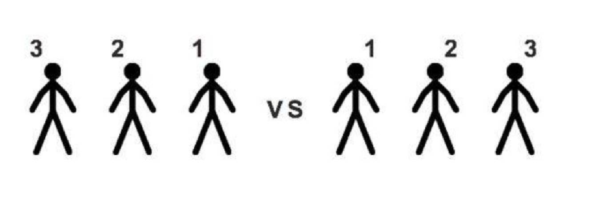
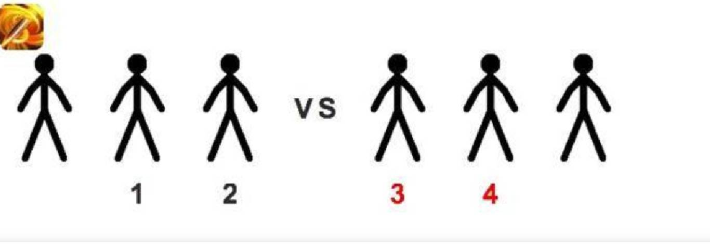

Normal attacks and combat skills have a range limit. According to the troops in the formation, the distance between each formation compared to the enemy will be different.

As shown in the following picture, there are 3 squads for our APC squad as well as the enemy's. No.1 is the Pioneer, No.2 is the Backbone, and No.3 is the Rear Guard.

1. Normal attack will attack the nearest enemy.
2. The combat skill's target depends on the effective range of the skill.

Take the Professional's precision shot as an example. When the Professional is in the Rear Guard, the skill is activated. The effective distance of the skill is 4, so it can hit the enemy's Pioneer or Backbone.

According to the previous example, the enemy Pioneer and Backbone can be hit. Assuming the enemy Pioneer is killed, the Backbone and the Rear Guard make up the position, and the Rear Guard enters the attack range.